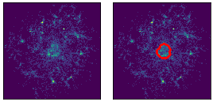

# Neural network for segmentation of lumen and other phenotypes of neural precursors on micropatterns

 
This code is a pytorch implementation of a convolutional DenseNet for semantic segmentation by [Jegou et al](https://arxiv.org/abs/1611.09326). The architecture is useful for training a segmentation network from scratch and can easily be adapted to work with different numbers of channels (here we use one channel in contrast to the more typical segmentation of 3-channel RGB images, but the code can work with any number of channels).

The network uses Adam optimization (learning rate of 0.0001 is a good value, but optimal learning rate may differ depending on the problem) and customizable data augmentation based on the [imgaug](https://github.com/aleju/imgaug) library.

## Requirements

* python 3.5 or higher 
* pytorch
* imgaug
* tifffile
* cv2
* tqdm

## Usage

* Prepare images and corresponding ground truth as .tif and _Labels.tif files, e.g. im1.tif and im1_Labels.tif. This naming convention is the default output of [Ilastik](http://ilastik.org) which we use to annotate data (note: Ilastik is used only as an annotation tool here, i.e. Ilastik's training features are not used, and any other software can be used to generate the training data). Put the data in a directory called 'train'.

* Train network using run_dense_lumen.run(base_dir), where base_dir is the directory that contains the 'train' directory with the annotated training data. Example of how to train and save a network are given in train_net.ipynb.

* Test network on validation data, as demonstrated in test_net.ipynb.

## Code overview

* run_dense_lumen.py: 

    run()
    Initializes and runs the training. Parameters are 
    
    - base_dir: directory 
    - model_type: depth of the network (e.g. '56' for a medium sized, '103' for the largest one)
    - batch size: (depends on your graphics card)
    - shuffle: (set to True during training)
    - n_epoch: number of training epochs
    - weight: can give a higher weight to one of the classes to be segmented (see the weight parameter in pytorch's NLLLoss2d function)
    - transform: whether to transform images (data augmentation)
    - learning rate: for Adam optimizer
    
    LumenDataset(root_dir)
    Class for loading the images and the ground truth. Looks for \*.tif in root dir and associated \*_Labels.tif files generated by Ilastik (or some other way). Applies data augmentation and returns image and segmentation as torch tensors.
    
* fc_densenet_torch: Implementation of the network with different number of layers.

* affine_transforms: Image transforms for the data augmentation.

    